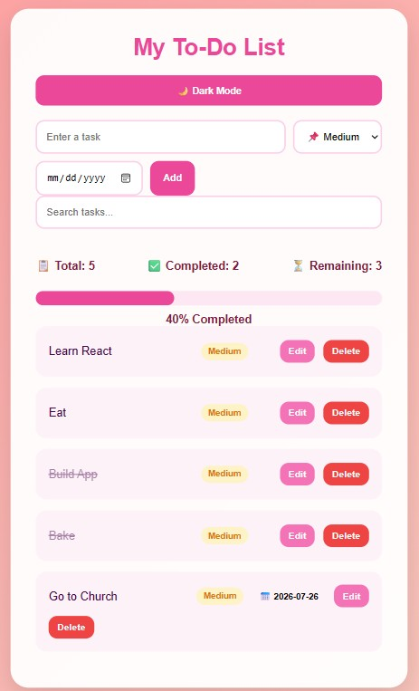
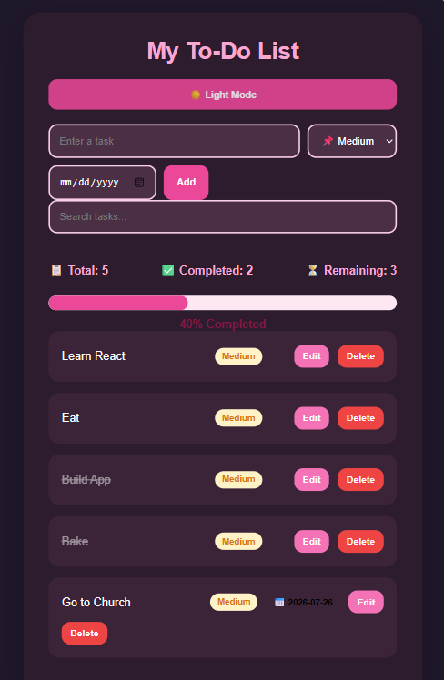
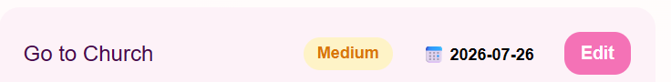
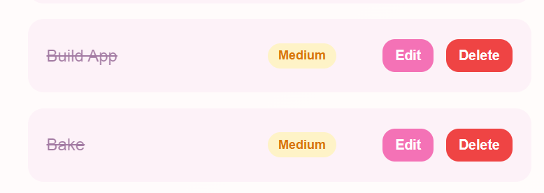

# 💗 Pink Todo App

A modern, responsive, and installable **Progressive Web Application (PWA)** built using **HTML, CSS, and JavaScript**.

Pink Todo App helps users organize daily activities by creating tasks, setting priorities, adding deadlines, tracking productivity, and managing completed tasks through a clean and user-friendly interface.

The project demonstrates frontend development skills including **DOM manipulation, JavaScript logic, browser storage, responsive design, Progressive Web App development, and UI/UX improvements**.

---

# 🚀 Live Demo

🔗 https://wendynicolatomusoni.github.io/todo-app/

---

# ✨ Features

## ✅ Task Management

- Add new tasks
- Edit existing tasks
- Delete tasks
- Mark tasks as completed
- Store tasks permanently using Local Storage
- Track pending and completed tasks

---

## ⭐ Priority Management

Users can assign priorities to tasks:

- 🔥 High Priority
- 📌 Medium Priority
- 🌱 Low Priority

This helps users focus on important activities and manage workload efficiently.

---

## 📅 Due Dates

- Add deadlines to tasks
- Display task due dates
- Track upcoming tasks
- Improve time management and productivity

---

## 🔍 Search Functionality

- Search tasks instantly
- Filter tasks based on keywords
- Quickly find specific tasks

---

## 🌙 Dark Mode

- Switch between light and dark themes
- Improves accessibility
- Provides a better user experience

---

## 📊 Progress Dashboard

The dashboard tracks productivity by displaying:

- Total tasks
- Completed tasks
- Remaining tasks
- Completion percentage
- Visual progress bar

---

## 📱 Progressive Web App Features

The application includes modern PWA capabilities:

- Installable on supported devices
- Mobile-friendly responsive design
- Web App Manifest
- Service Worker support
- Custom application icons
- App-like experience on mobile devices

---

# 🖥️ Screenshots

## Main Dashboard



---

## Dark Mode



---

## Priority Levels and Due Dates



---

## Completed Tasks and Progress Tracking



---

# 🛠️ Technologies Used

## Frontend

- HTML5
- CSS3
- JavaScript (ES6)

## Browser Technologies

- DOM Manipulation
- Local Storage API
- Web App Manifest
- Service Workers

## Development Tools

- Visual Studio Code
- Live Server Extension
- Git
- GitHub

---

# 📂 Project Structure

```
todo-app/

│
├── index.html
├── style.css
├── script.js
├── manifest.json
├── service-worker.js
│
├── icons/
│   ├── icon-192.png
│   └── icon-512.png
│
├── screenshots/
│   ├── dashboard.jpg
│   ├── dark-mode.png
│   ├── priority-dates.png
│   └── completed-tasks.png
│
└── README.md
```

---

# ▶️ How to Run the Project

## Option 1: Using VS Code Live Server

1. Clone or download the repository.

2. Open the project folder in Visual Studio Code.

3. Install the **Live Server** extension.

4. Right-click:

```
index.html
```

5. Select:

```
Open with Live Server
```

6. The application will open in your browser.

---

# 📲 Installing the Application

1. Open the application in a supported browser.

2. Select:

```
Install App
```

or:

```
Add to Home Screen
```

3. Launch the application like a normal mobile application.

---

# 📌 How The Application Works

1. Users enter a task using the input field.

2. They select:
   - Task priority
   - Due date

3. JavaScript dynamically creates and displays the task.

4. Tasks are stored in the browser using Local Storage.

5. When users complete tasks:
   - The task status updates.
   - The dashboard automatically updates productivity statistics.

6. Users can switch between light mode and dark mode.

---

# 💡 Key Concepts Demonstrated

This project demonstrates:

- JavaScript functions
- Variables and objects
- Arrays
- DOM manipulation
- Event listeners
- Local Storage
- Dynamic HTML generation
- CSS Flexbox
- Responsive web design
- Progressive Web App development
- User interface design

---

# 🔮 Future Improvements

Possible improvements:

- User authentication
- Cloud database integration
- Drag-and-drop task sorting
- Task categories
- Push notifications
- Calendar integration
- React version of the application
- Backend API integration
- Multi-device synchronization

---

# 👩‍💻 Author

**Wendy Nicola Tomusoni**

Computer Science Student

Interested in:

- Frontend Development
- Software Engineering
- Cybersecurity

GitHub:
https://github.com/WendyNicolaTomusoni

LinkedIn:
(Add your LinkedIn profile link)

---

# 📌 Project Status

Completed ✅

---

# ⭐ Repository

If you find this project useful, consider giving it a star ⭐